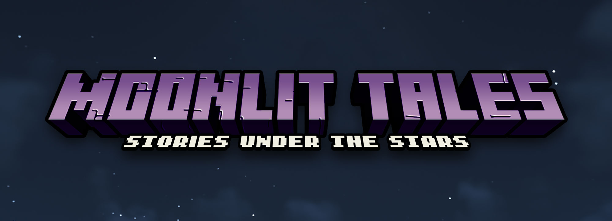

# Changelog

## Version 1.0.1 [Unreleased]

**Cut a lot of fat and add the rest of Team Abnormals fantastic mods. I will be doing more in-depth patching later on.**

### Added
+ Polymorph
+ Miner's Delight
+ Minecolonies Resource Pack (More voicelines)
+ Upgrade Aquatic
+ Atmopsheric
+ Autumnity
+ Environmental
+ Clayworks
+ Woodworks
+ Boatload
+ Allurement
+ Berry Good
+ Buzzier Bees
+ Incubation
+ Neapolitan
+ Personality
+ Savage & Ravage
+ Creeper Overhaul
+ Unusual End
+ Xtra Arrows

### Removed
+ Notes
+ Chalk
+ Map Atlas
+ Aaudio (Useless lib)
+ Second Chance
+ Polylib
+ Little Logistics
+ Little Contraptions
+ Immersive Weathering
+ ConnectedTexturesMod (Doesn't work)
+ Map Atlas
+ Corail Woodcutter

## Version 1.0.0
Brand new :)
